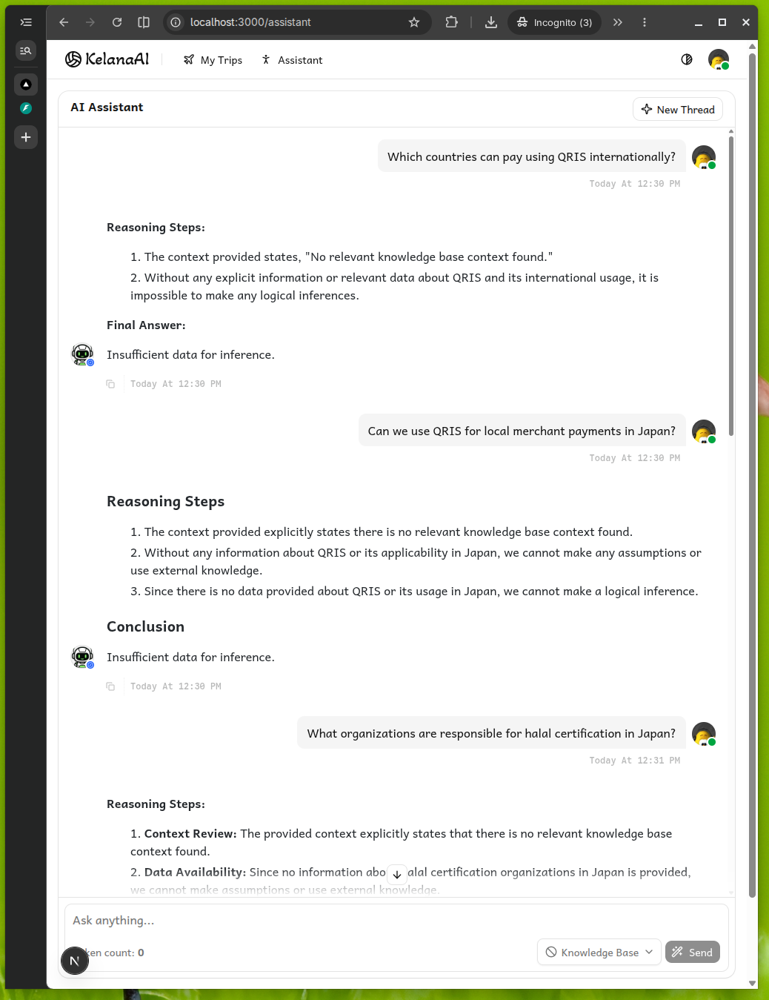
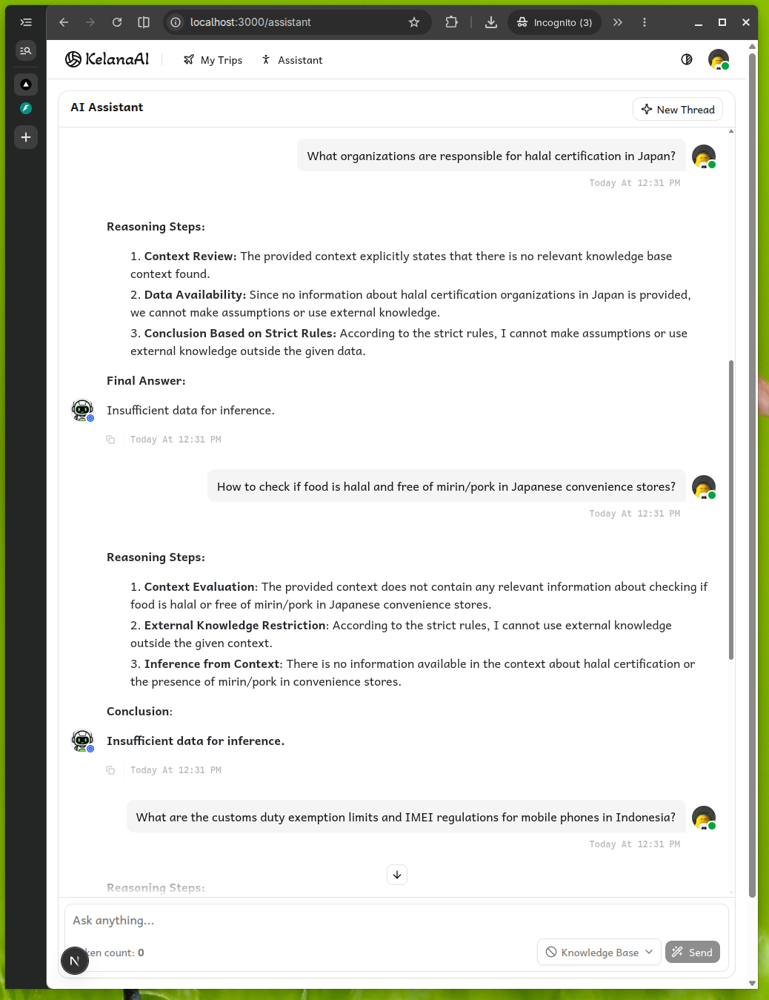
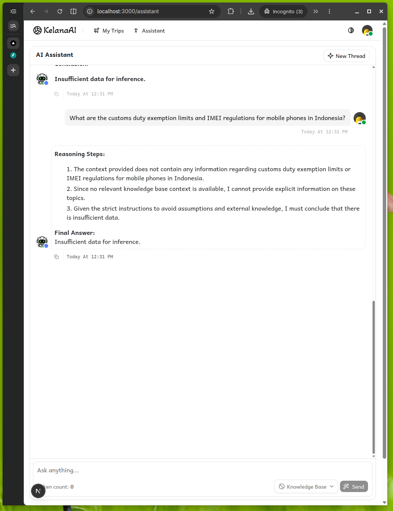
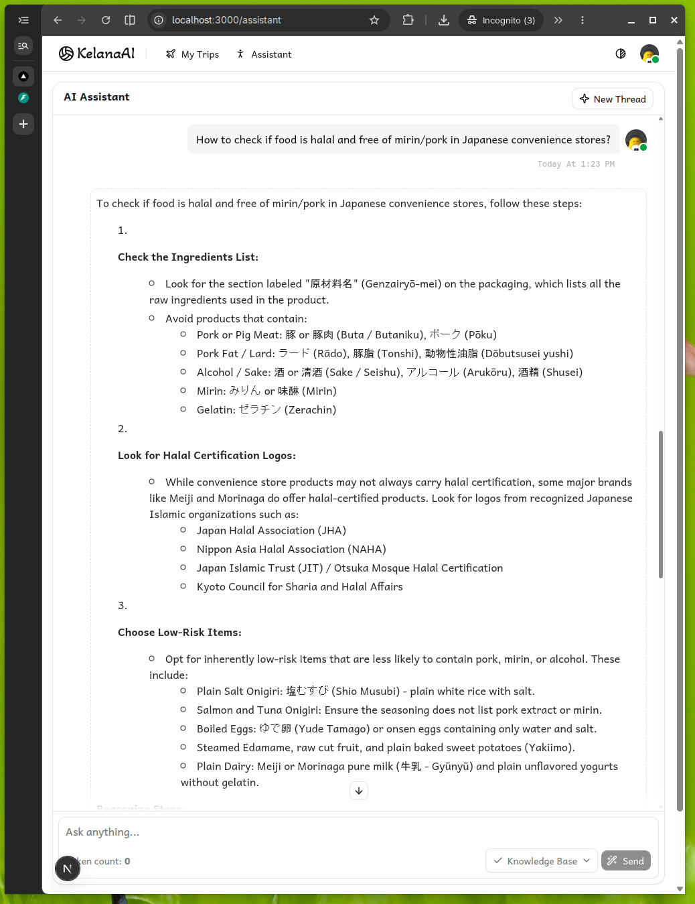
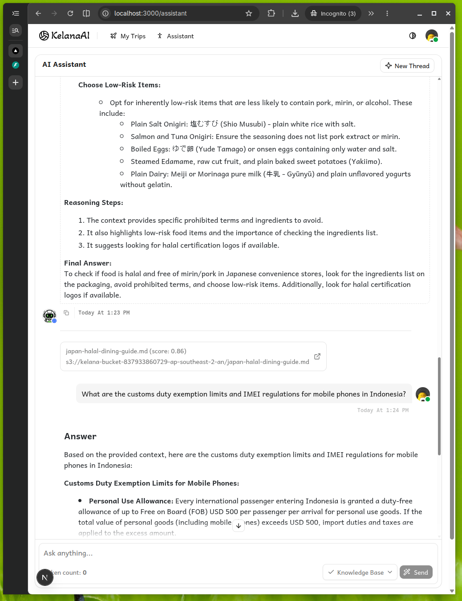
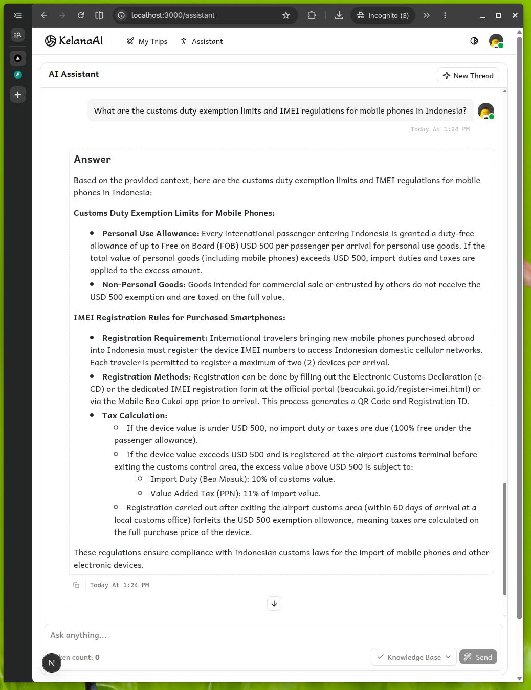

# Session 09

Teaching KelanaAI to Read Knowledge

## Assignments

- [x] Upload 3+ travel documents
  - [x] Prepare and upload at least three additional travel documents. You can use PDFs, text files, or Markdown. Ensure these documents are successfully synced to S3.
- [x] Test with 5 new questions
  - [x] Test the system by asking five new questions. Make sure the questions specifically require information from the new documents you just uploaded in the previous step.
- [x] Record improved answers
  - [x] Record and document improvements in the answers generated by the AI. You should directly compare the answers provided by the RAG system with those generated purely by the base model.
- [x] Git & Version Control
  - [x] As per the Commit and push your solution instructions, save all your changes and push them to the repository.

## Repository

https://github.com/IronGeek/kelana-ai/commits/session-9

## Implementation & Testing

The following questions are asked twice to the LLM, first with only the base model and second with additional context from knowledge base (RAG)

1. Which countries can pay using QRIS internationally?
   
   

     
Base Model

     
   

   
   

     
With Knowlodge Base

     
   

2. Can we use QRIS for local merchant payments in Japan?
   
   

     
Base Model

     
   

   
   

     
With Knowlodge Base

     
   
   

3. What organizations are responsible for halal certification in Japan?
   
   

     
Base Model

     
   

   
   

     
With Knowlodge Base

     
   
   

4. How to check if food is halal and free of mirin/pork in Japanese convenience stores?
   
   

     
Base Model

     
   

   
   

     
With Knowlodge Base

     

     
   

5. What are the customs duty exemption limits and IMEI regulations for mobile phones in Indonesia?
   
   

     
Base Model

     
   

   
   

     
With Knowlodge Base

     

     
   

